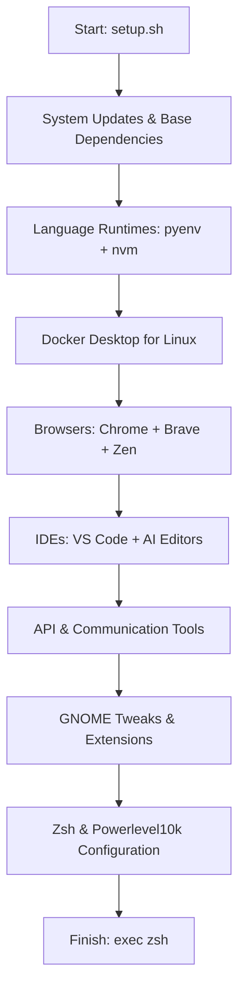

# 🚀 Ultimate Unified Dev Setup

A single, robust script to automate the setup of a professional development environment on Ubuntu/Debian-based systems. This setup is designed for **maximum productivity**, **aesthetic excellence**, and **idempotent stability**.

---

## 🏗️ Setup Workflow



---

## 🛠️ Feature Overview

### 🎨 Shell & Aesthetic
- **Zsh Default**: Oh My Zsh framework with **Powerlevel10k** theme.
- **Smart Completion**: Autosuggestions and Syntax Highlighting.
- **Modern CLI**: `eza` (ls), `bat` (cat), `zoxide` (z), `rg` (grep), `fd` (find).
- **Fonts**: JetBrains Mono Nerd Font & Font Awesome for rich icons.

### 💻 Developer Ecosystem
- **Runtimes**: `pyenv` (Python) and `nvm` (Node.js/npm/pnpm).
- **Virtualization**: **Docker Desktop** (GUI + Engine + Compose).
- **IDEs (AI-Native)**: Cursor, Windsurf, Antigravity, Qoder, VS Code, and **JetBrains Toolbox**.

### 🌐 Apps & Utilities
- **Browsers**: Chrome, Brave, Zen Browser.
- **API Testing**: Insomnia, Postman, Requestly.
- **Communication**: Slack, AnyDesk.
- **Tools**: Redis Insight, VLC, Terminator, Warp.
- **Monitoring**: CPU/Network/Memory GNOME Shell Extensions.

---

## 🚀 Getting Started

1. **Make the script executable**:
   ```bash
   chmod +x setup.sh
   ```
2. **Run the Setup**:
   ```bash
   ./setup.sh
   ```

---

## 🏁 Post-Installation Actions

> [!IMPORTANT]
> Some changes require a shell restart or system logout to take effect.

1. **Apply Zsh Changes**: Run `exec zsh` or restart your terminal.
2. **Setup P10K**: If the wizard doesn't start automatically, run `p10k configure`.
3. **Docker Access**: Log out and log back in to refresh group permissions.
4. **Enable Extensions**: Open **Extension Manager** and enable the pre-installed monitoring tools.

---

## 🔍 Verification & Troubleshooting

### Verification Commands
| Tool | Command to Verify |
| :--- | :--- |
| **Zsh** | `zsh --version` |
| **Node.js** | `node -v` |
| **Python** | `python --version` |
| **Docker** | `docker ps` |
| **Modern LS** | `ls` (should show icons) |
| **Modern Cat** | `cat setup.sh` (should show colors) |

### Troubleshooting Tips
- **Docker Desktop**: If it fails to start, ensure virtualization (VT-x/AMD-V) is enabled in your BIOS.
- **GNOME Shell**: If extensions aren't appearing, restart the shell (`Alt+F2`, type `r`, then `Enter` - on X11 only).
- **NVM/Pyenv**: If commands are "not found" immediately after install, check your `~/.zshrc` for the initialization blocks.

---

## ⚡ Fast-Path Shortcuts (Zsh Aliases)

The setup pre-configures several productivity-boosting aliases in your `~/.zshrc`:

### 📂 File Management (Modern Replacements)
| Alias | Tool | Description |
| :--- | :--- | :--- |
| `ls` | `eza` | List files with icons and colors |
| `ll` | `eza -al` | Detailed list with icons |
| `tree`| `eza --tree` | Visual directory tree |
| `cat` | `bat` | View file with syntax highlighting |
| `z <dir>` | `zoxide` | Jump to a directory instantly |

### 🐙 Git & Dev
| Alias | Command |
| :--- | :--- |
| `gs` | `git status` |
| `gd` | `git diff` |
| `gp` | `git push` |
| `gl` | `git pull` |
| `pd` | `pnpm dev` |
| `pi` | `pnpm install` |

---

## 📂 Project Structure

- `setup.sh`: The master unified setup script.
- `README.md`: This comprehensive guide.
- `~/Apps`: Directory where AppImages (like Zen Browser) are managed.

---
*Created with ❤️ for a professional Linux developer setup.*

